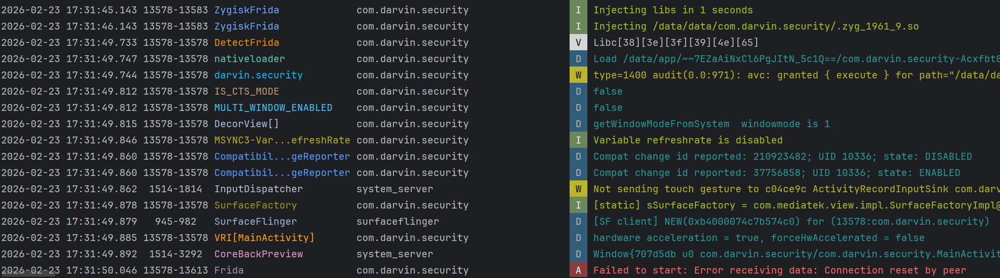

# ZygiskFrida

基于 [lico-n/ZygiskFrida](https://github.com/lico-n/ZygiskFrida) 改进而来的增强版本，在原有 Zygisk 注入 Frida Gadget 的基础上，新增了 **Seccomp Tracer**（syscall 行为探测）和 **Ptrace 远程内存 Patch**（SO 加载时精准 patch）两大核心能力，形成一套「探测 → Patch → 调试」的完整反反调试工作流。

## 设计想法

如果一定要用Frida的话，那么建议一定要试试这个模块。

### 阶段一：Seccomp Tracer — 我来检测你的检测

利用 **seccomp BPF + ptrace** 拦截目标进程的关键 syscall（`openat`、`faccessat`、`readlinkat`、`read`、`mmap`、`exit_group`、`kill` 等），以 probe 模式记录反调试进程的所有行为，从 syscall 日志中倒推出检测点和检测逻辑。

- 自动隐藏 TracerPid（篡改 `/proc/self/status` 读取结果）
- 自动过滤 /proc/maps 中的 Frida 相关条目
- 可选阻止应用自毁（`exit_group` / `kill` / `tgkill`）

### 阶段二：Ptrace 远程 Patch —攻守互换

根据阶段一的探测结果，通过 `config.json` 配置 hook 点（SO 名 + 偏移），tracer 通过 seccomp 拦截 `openat` → `mmap` → `mprotect` 这条 SO 加载链路，在 linker 执行 `mprotect(PROT_READ|PROT_EXEC)` 的瞬间——即 `.text` 段已加载完毕、但 `.init_array` 构造函数尚未执行——通过 `PTRACE_POKEDATA` 写入 patch（`MOV X0, #N; RET`），精准绕过反调试检测函数，防止应用自毁。

### 阶段三：Frida Gadget — 调试

在反调试被压制后，注入 Frida Gadget 进入主进程，以 listen 或 connect 模式启动(推荐connect模式)，配合 Frida 脚本快速定位关键函数节点，进行深度分析。Frida内部其实有很多很多的特征，一时半会也说不完，更新频率又比较快，实在不想去内部魔改构建，要说一定要用的理由就是Stalker吧。

实现了一个zygote外部起socket连接传递给Frida gadget来连接远程的功能，有些应用检测到Frida后其实就直接传递关闭指令给远端结束Frida的连接了，这个一时半会我也没太搞懂是怎么回事，改内部通讯协议是不可能改的，最后就有了那么一个中间人传递的思想，等我摸清楚Frida的完整检测逻辑之后再说。

[Frida检测](https://github.com/darvincisec/DetectFrida)，经测试这个是能够精准绕过实现Frida附加调试的：




## 实现部分

### 隐藏 ptrace

tracer 作为独立的 root 进程通过 `PTRACE_SEIZE`（而非 `PTRACE_ATTACH`）附加到目标进程，不会发送 `SIGSTOP`。当目标进程读取 `/proc/self/status` 时，seccomp 拦截 `read()` syscall，在内核将数据写入用户空间缓冲区之后、syscall 返回之前，tracer 扫描缓冲区中的 `TracerPid:\t<pid>\n`，通过 `PTRACE_POKEDATA` 将 pid 替换为 `0` 并用空格填充。对于目标进程而言，TracerPid 始终为 0。

### 精准 patch 目标 SO

核心思路是监听 native linker 的 SO 加载流程：

1. **追踪 fd**：seccomp 拦截 `openat()`，当路径匹配目标 SO 时记录返回的 fd
2. **记录基址**：拦截 `mmap(fd, ...)`，记录 SO 的 `load_bias`（内存基址 - 文件偏移）
3. **触发 patch**：拦截 `mprotect(addr, len, PROT_READ|PROT_EXEC)`——这是 linker 将 `.text` 段设为可执行的最后一步，此时代码已完整加载但 `.init_array` 尚未执行
4. **远程写入**：通过 ptrace 远程执行 `mprotect(page, 4096, RWX)` 临时开写权限，用 `PTRACE_POKEDATA` 写入 `MOV X0, #N; RET`（8 字节），再恢复 `RX` 权限刷新 I-cache

这个时机窗口是关键——比进程内 hook `android_dlopen_ext` 更早，能在任何构造函数执行前完成 patch。

### 行为捕获原理

seccomp BPF 过滤器在内核态对每个 syscall 做匹配，命中时返回 `SECCOMP_RET_TRACE` 触发 `PTRACE_EVENT_SECCOMP` 停止。tracer 在 syscall 入口读取参数（路径、fd、地址等），在 syscall 出口读取返回值，配合 ARM64 帧指针（x29）链回溯调用栈，将完整的 syscall 行为（时间戳、PID、syscall 名、路径、调用者 SO+偏移）写入日志文件。

### /proc/maps 伪装

反调试常通过读取 `/proc/self/maps` 扫描可执行段并校验内存 checksum。tracer 拦截对 maps 文件的 `read()`，构建一份净化快照：将受保护库（如被 Frida 修改过的 SO）的权限从 `r-xp` 改为 `r--p`，使反调试的 `scan_executable_segments()` 跳过这些段，从而绕过 ELF 内存校验。

## 新增特性

| 特性 | 说明 |
|------|------|
| **Seccomp Tracer** | seccomp BPF 过滤 + ptrace 监控，拦截/记录/篡改目标进程 syscall |
| **SO 加载时 Patch** | 监听 `openat` → `mmap` → `mprotect` 链路，在 `.init_array` 前通过 ptrace 远程写入 patch |
| **TracerPid 隐藏** | 篡改 `/proc/self/status` 读取结果，TracerPid 始终为 0 |
| **Maps 伪装** | 篡改 `/proc/self/maps` 中受保护库的权限位，绕过 ELF 内存校验 |
| **自毁拦截** | `tracer_block_self_kill` 阻止 `exit_group`/`kill`/`tgkill` |
| **Syscall 日志** | probe 模式输出完整 syscall trace + 调用栈回溯到指定路径 |

## 配置说明

配置文件路径：`/data/adb/re.zyg.fri/config.json`

```jsonc
{
  "targets": [{
    "app_name": "com.example.package",
    "enabled": true,
    "start_up_delay_ms": 0,

    // --- Frida Gadget 注入 ---
    "injected_libraries": [
      {"path": "/data/adb/re.zyg.fri/libgadget.so"}
    ],
    "gadget_interaction": "listen",   // "listen" | "connect"
    "gadget_on_load": "resume",       // "wait" | "resume"
    "gadget_listen_port": 0,
    "gadget_connect_address": "127.0.0.1",
    "gadget_connect_port": 27052,
    "gadget_connect_use_unix_proxy": false,

    // --- 子进程控制 ---
    "child_gating": {
      "enabled": false,
      "mode": "freeze"                // "freeze" | "kill" | "inject"
    },

    // --- Seccomp Tracer（阶段一） ---
    "tracer_mode": "off",             // "off" | "probe"
    "tracer_log_path": "/data/local/tmp/re.zyg.fri/syscall_trace.log",
    "tracer_verbose_logs": false,
    "tracer_block_self_kill": false,

    // --- SO 加载时 Patch（阶段二） ---
    "so_load_patches": [
      {
        "so_name": "xxx.so",
        "hooks": [
          {"offset": "0x163c10", "return_value": 0},
          {"offset": "0x4d8bd8", "return_value": -1}
        ]
      }
    ]
  }]
}
```

### 典型工作流

```bash
# 1. 先用 probe 模式探测 syscall 行为
adb shell 'su -c "cat /data/local/tmp/re.zyg.fri/syscall_trace.log"'

# 2. 分析日志，找到反调试 SO 和关键偏移，配置 so_load_patches 中的 patch 点

# 3. Frida Gadget Connect模式
在远端配置frida-portal，监听接受端口，用Frida-tool去连接frida-portal的控制端口调试进程就行
```

## 构建

```bash
./gradlew :module:assembleRelease
# 输出: out/zygiskfrida-v1.9.1-zygisk-release.zip

# 或直接刷入设备
./gradlew :module:flashAndRebootZygiskRelease
```

## 前提条件

- 已 Root 的设备（Magisk + Zygisk 启用）
- NDK 25.2.9519653（构建时需要）

## TODO

- [ ] 整理代码结构
- [ ] 捕捉进程自毁时的堆栈，更快定位关键检测点
- [ ] 完善行为分析 tracer，加入更多行为特征捕捉
- [ ] 多架构支持（目前仅实现了 ARM64）

## 关于 `so_load_patches` 命名

配置字段已统一改为 `so_load_patches`，用于描述“目标 SO 加载阶段的远程 patch 点”，避免与早期进程内 Dobby inline hook 语义混淆。

## 一堆史山：

哪天心情好就去好好清理，以及tracer部分优化空间非常巨大，调试阶段启用、后续patch通过建议关闭，对运行性能会有一定影响，行为分析日志写得挺烂，不过成功了管他呢。

## Credits

- [lico-n/ZygiskFrida](https://github.com/lico-n/ZygiskFrida) — 原项目
- [Perfare/Zygisk-Il2CppDumper](https://github.com/Perfare/Zygisk-Il2CppDumper) — 灵感来源
- [hexhacking/xDL](https://github.com/hexhacking/xDL) — 动态链接器辅助库

## License

MIT License — 基于原项目 [lico-n/ZygiskFrida](https://github.com/lico-n/ZygiskFrida) 的 MIT 协议。
